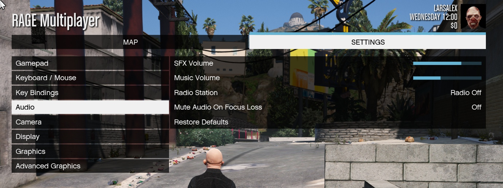

# 🔶 Custom Pause Menu 🔶

Using the game file **pausemenu.xml** to remove unnecessary/faulty items from the pause menu *(esc)* in **RAGE Multiplayer**.



*Also fixed the radio volume control 😁*

## What was changed 🛠

###### Remote location 🗑

+ History, statistics, game, network, friends, gallery, store, rockstar editor

###### Deleted sub-items 🗑

+ Voice chat, notifications, rockstar editor, save and launch

###### Deleted options 🗑

+ ❌ (TODO) ```Key assignment``` -> everything related to GTA Online
+ ```Audio``` -> everything related to GTA Online & Self Radio
+ ```Video``` -> ```Subs```

###### Added items 🛠

+ ```Video``` -> ```Language```

###### Fixed options 🛠

+ ```Audio``` -> ```Music volume```
+ ```Audio``` -> ```Radiostation```

## Requirements ⚙️

- RAGE Multiplayer server version [1.1+](https://rage.mp/forums/topic/7175-rage-multiplayer-110-dp1-goes-public-beta/)

## Installation 💾

- Copy the ```client_packages``` folder to the server folder

## Good guy's ❤️

- **hromik** for the help
- **Despair** for playing World Of Tanks

## README 📒

[README](https://github.com/Larsalex1337/ragemp-custom-pausemenu/blob/main/README_RU.MD) (RU)

## LICENSES 📝

[MIT License](./LICENSE)
