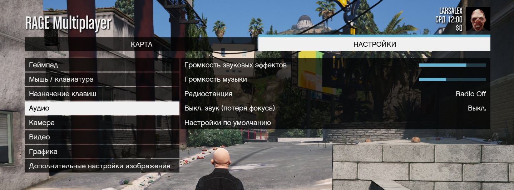

# 🔶 Кастомное меню паузы 🔶

Использование игрового файла **pausemenu.xml** для удаления ненужных/неисправных пунктов из меню паузы *(esc)* в **RAGE Multiplayer**.



*Так же исправлена работа регулятора громкости радио 😁*

## Что изменено 🛠

###### Удалённые пункты 🗑

+ История, статистика, игра, сеть, друзья, галерея, магазин, редактор rockstar

###### Удалённые подпункты 🗑

+ Голосовой чат, уведомления, редактор rockstar, сохранение и запуск

###### Удалённые опции 🗑

+ ❌ (TODO) ```Назначение клавиш``` -> всё что связано с GTA Online
+ ```Аудио``` -> всё что связано с GTA Online и Self Radio
+ ```Видео``` -> ```Субтитры```

###### Добавленные пункты 🛠

+ ```Видео``` -> ```Язык```

###### Исправленные опции 🛠

+ ```Аудио``` -> ```Громкость музыки```
+ ```Аудио``` -> ```Радиостанция```

## Требования ⚙️

- Версия сервера RAGE Multiplayer [1.1 и выше](https://rage.mp/forums/topic/7175-rage-multiplayer-110-dp1-goes-public-beta/)

## Установка 💾

- Скопировать папку ```client_packages``` в папку с сервером

## Благодарности ❤️

- **hromik** за помощь в работе

## README 📒

[README](https://github.com/Larsalex1337/ragemp-custom-pausemenu/blob/main/README.MD) (EN)

## Лицензии 📝

[MIT License](./LICENSE)
